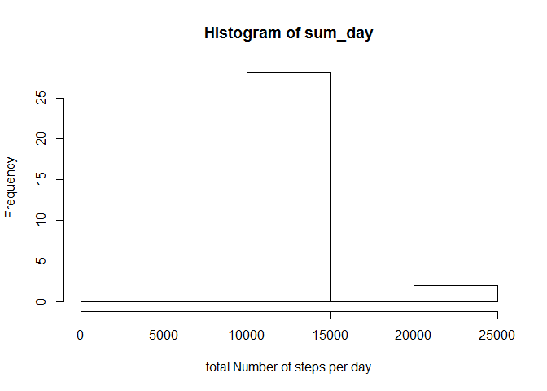
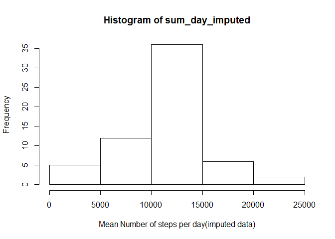
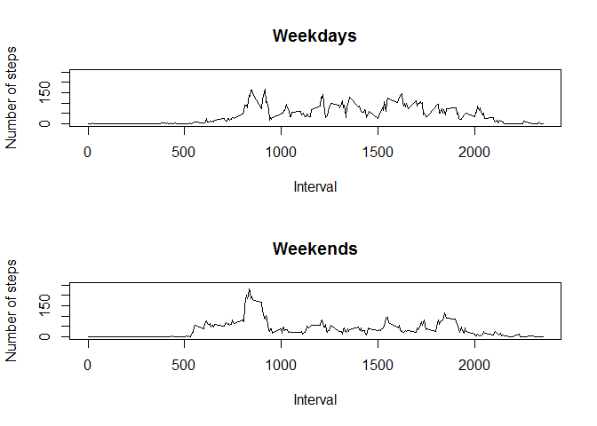

# Reproducible Research: Peer Assessment 1

## Loading and preprocessing the data

```r
dataset <- read.csv("activity.csv")
dataset$date <- as.Date(dataset$date)
```

## What is mean total number of steps taken per day?

```r
#Calculating  the total number of steps for each day.
sum_day <- tapply(dataset$steps,dataset$date,sum)
hist(sum_day, xlab = "total Number of steps per day")
```

<!-- -->

### mean of total number of steps per day

```r
mean(sum_day, na.rm = TRUE)
```

```
## [1] 10766.19
```

### median of total number of steps per day


```r
median(sum_day, na.rm = TRUE)
```

```
## [1] 10765
```

## What is the average daily activity pattern?


```r
#Calculating the mean number of steps for each interval.
steps <- tapply(dataset$steps,dataset$interval, mean, na.rm=TRUE)

mean_act_day <- as.data.frame(steps)
mean_act_day["interval"] <-  row.names(mean_act_day)

with(mean_act_day, 
     plot(interval, steps, type="l")
)
```

<!-- -->

### which interval has the highest average of steps

```r
mean_act_day$steps[which.max(mean_act_day$steps)]
```

```
##      835 
## 206.1698
```

## Imputing missing values


```r
print(paste("Total Number of NA values: ", sum(is.na(dataset$steps))))
```

```
## [1] "Total Number of NA values:  2304"
```


```r
#Creating new copy of the dataset to imput missing values by 
#using mean values for each interval.
new_dataset <- dataset
na_loc <- is.na(new_dataset$steps)
na_int <- new_dataset$interval[na_loc]

new_dataset$steps[na_loc] <- mean_act_day$steps[mean_act_day$interval %in% na_int]
```


```r
#Calculating the total number of steps each day.
sum_day_imputed <- tapply(new_dataset$steps,dataset$date,sum)
hist(sum_day_imputed, xlab = "Mean Number of steps per day(imputed data)") 
```

<!-- -->

### Average of total number of steps per day for data with imputed missing values.


```r
mean(sum_day_imputed)
```

```
## [1] 10766.19
```


### median of total number of steps per day for data with imputed missing values.


```r
median(sum_day_imputed)
```

```
## [1] 10766.19
```

## Are there differences in activity patterns between weekdays and weekends?


```r
library(timeDate)

#Converting dates to weekdays and weekends
new_dataset['day_type'] <- factor(isWeekday(new_dataset$date, wday=1:5)
                                       , labels = c("weekday", "weekend"))

#Calculating the mean of number steps for each interval in each day_type
steps <- tapply(new_dataset$steps,list(dataset$interval, new_dataset$day_type), mean, na.rm=TRUE)

steps <- as.data.frame(steps)
steps['interval'] = row.names(steps)

#Preparing to plot 2 graphs in 1 plot (2 rows and 1 column)
par(mfrow=c(2,1))
plot(steps$interval, steps$weekday, type = "l", main="Weekdays",
     xlab="Interval", ylab="Number of steps", ylim = c(0,250))

plot(steps$interval, steps$weekend, type = "l", main="Weekends",
     xlab="Interval", ylab="Number of steps",ylim = c(0,250))
```

<!-- -->

